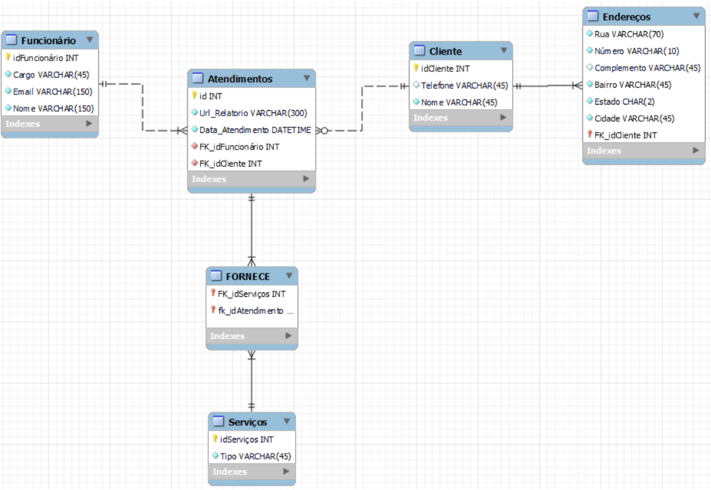

<h1 align="center">🎲 Banco de Dados para Gerenciamento de Atendimentos </h1>

  
  
  
  

   

 
    <h3>📜 Documentação </h3>
    <a href="https://github.com/gabryel-araujo/projeto-bd2/blob/main/assets/Documenta%C3%A7%C3%A3o_Projeto_BD2.pdf">🔎 Clique aqui</a>

 
    <h3>📘 Objetivo</h3>
    
Construir um banco de dados que respeite as <a href="https://github.com/gabryel-araujo/projeto-bd2/blob/main/assets/Roteiro%20de%20projeto%20bd%20relacional%20vfinal.pdf">regras de negócio</a> estabelecidas previamente para o projeto.

 
    <h3>💻 Tecnologias e Ferramentas </h3>
    
    

 
  <h3>🧑🏻‍💻 Desenvolvedores</h3>
  
   
  

